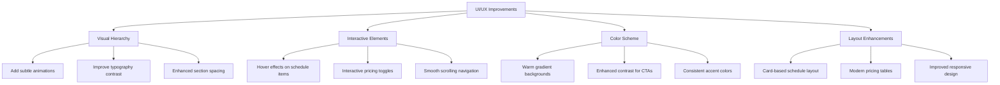

# Classes Page UI/UX Improvement Plan

## Visual Structure

## Detailed Improvements

### 1. Visual Hierarchy Improvements
- Add smooth fade-in animations for sections
- Increase contrast between headings and body text
- Use larger typography for key information
- Add visual separators between sections

### 2. Schedule Section Enhancement
- Convert to a card-based grid layout
- Add hover effects with scale transform
- Include visual indicators for different class types
- Improve mobile responsiveness

### 3. Pricing Section Modernization
- Convert table to modern pricing cards
- Add popular/recommended tags
- Include feature lists for each plan
- Add interactive duration selector

### 4. Color Scheme Updates
- Implement warm gradients (orange to peach)
- Add subtle background patterns
- Use consistent accent colors throughout
- Improve contrast for better readability

### 5. Interactive Elements
- Add smooth scroll to sections
- Implement hover states for all interactive elements
- Add tooltip information for class types
- Include expandable class descriptions

## Implementation Notes

### Priority Order
1. Color scheme updates - establish new visual foundation
2. Schedule section enhancement - improve core functionality
3. Pricing section modernization - increase conversion
4. Visual hierarchy improvements - enhance readability
5. Interactive elements - polish user experience

### Technical Considerations
- Use Tailwind CSS for styling
- Implement smooth animations with CSS transitions
- Ensure mobile-first responsive design
- Maintain accessibility standards